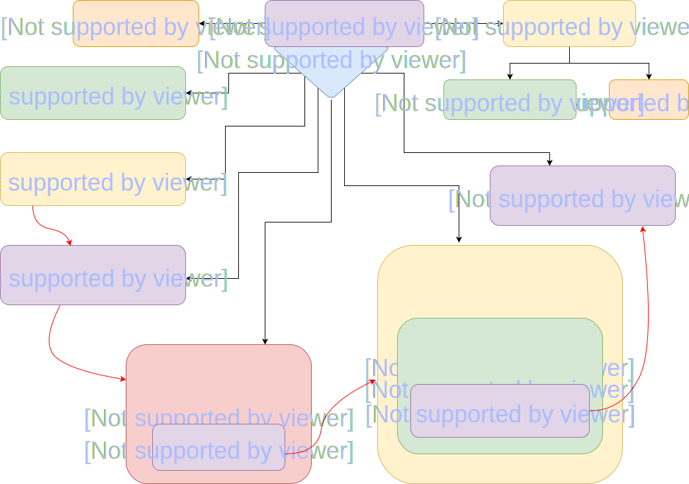

# Formulary (Planning)

#### A color formula and service history management system for hairstylists _2018_

###### by **Adam Smith**

## Description

Formulary is a hairstylist's color formula and service history management tool. A user will be able to keep a list of profiles for their clients. They will be able to add new profiles, edit existing profiles, and delete client profiles. They will also be able to write notes for each service performed for the client including instructions, formula notes, comments, amount of time the service took, and amount charged.

If I have the opportunity I would like to add the ability to save images with the client profile and with each service, log in with email and password, share service and formula notes with other users, search for formulas by keywords (such as color or type of service), and finally to be able to use Formulary as a mobile app.

## Proposal

**Name of Student:** Adam Smith

**Name of Project:** “Formulary"

**Project’s Purpose or Goal:** A client service history management system for hairstylists.

**List the absolute minimum features the project requires to meet this purpose or goal:**

• As a user, I want to be able to access a list of client profiles.

• As a user, I want to be able to click on a client profile and get details about that client.

• As a user, I want to be able to see a history of services for each client, including formula notes.

**What tools, frameworks, libraries, APIs, modules and/or other resources (whatever is specific to your track, and your language) will you use to create this MVP? List them all here. Be specific.**

• React/Redux!

• Firebase database through Re-Base or something similar.

**If you finish developing the minimum viable product (MVP) with time to spare, what will you work on next? Describe these features here: Be specific.**

• As a user, I want to be able to log in to my account with email and password.

• As a user, I want to be able to save an image with each set of service notes to recall at a later time.

• As a user, I want to be able to use the this service as a mobile app.

• As a user, I want to be able to tag images with keywords that can be searched to find formulas and service notes without having to search though client profiles.

• As a user, I want to be able to share formulas and service notes with other users (other stylists).

**What additional tools, frameworks, libraries, APIs, or other resources will these additional features require?**

• User profiles with login will require some sort of authentication service. Firebase? Auth0?

• Images will require some sort of online storage, maybe Firebase storage.

• Mobile will require React Native.

**Is there anything else you’d like your instructor to know?**
I’m not super concerned about meeting MVP. Long term I would love to develop this app for mobile, as the user story is a lot stronger from that perspective. I have a lot of stylists in my life who love to brainstorm and daydream so there will be no shortage if ideas for new features to implement if/when the time comes.

## Technologies used

* ReactJS
* Webpack
* JSX
* Redux
